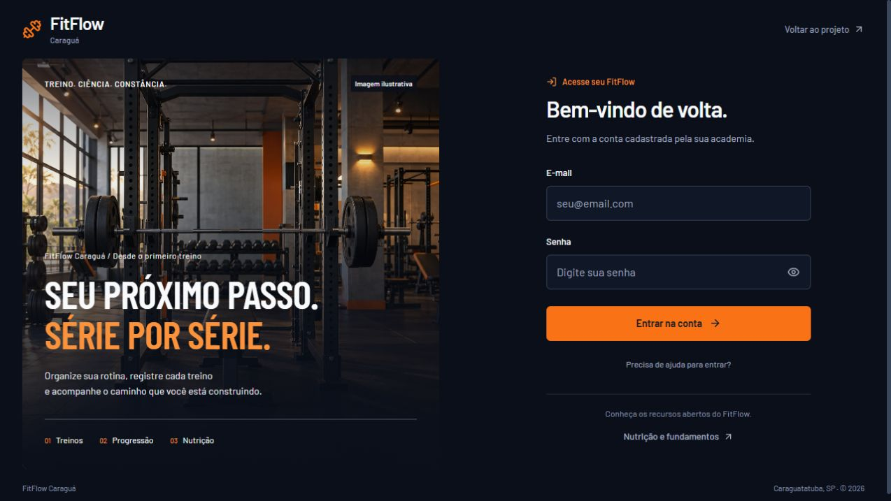

# FitFlow Caraguá

Projeto acadêmico de gestão de academia, com áreas de administrador, instrutor e aluno. Interface em português, identidade laranja e azul escuro. A [landing publicada](https://fitflow-lp.vercel.app) apresenta o sistema e aponta ao aplicativo; seu código fica no repositório [fitflow-LP](https://github.com/EznRB/fitflow-LP).

[Abrir o aplicativo](https://fit-flow-indol.vercel.app) · [Estado da entrega](docs/STATUS_ENTREGA.md) · [Guia de desenvolvimento](docs/DESENVOLVIMENTO.md) · [Ciência e limites](docs/CIENCIA.md)



Login editorial publicado na revisão `3adf5c1`. Captura de desktop; versões mobile e tablet verificadas em [Estado da entrega](docs/STATUS_ENTREGA.md). As contas demonstrativas são fornecidas por arquivo privado, sem senha universal publicada.

## Desenvolvimento

Node.js **24.x**; MySQL/MariaDB acessível para a demonstração local. **Docker não é necessário.** O ambiente preparado neste computador usa MariaDB nativo em `127.0.0.1:3308`, isolado em `.local-db/`.

```powershell
cd server
npm ci
npm run db:local:start
npm run db:local:migrate
npm run db:local:seed
npm run dev:local
```

Aplicativo: `http://127.0.0.1:3107/`. As contas demonstrativas têm senhas individuais em `server/.demo-credentials.local.json`, ignorado pelo Git. O seed só opera no banco local identificado, é repetível e preserva registros. Não há senha universal publicada.

Para configurar outro computador ou banco, consulte [Desenvolvimento](docs/DESENVOLVIMENTO.md). Não execute seed demonstrativo em produção.

O [aplicativo publicado](https://fit-flow-indol.vercel.app) usa Neon PostgreSQL 17 Free em São Paulo, com schema/migrations separados e conexão pooled. Gates HTTPS confirmaram os três perfis, autorização, gestão, nutrição optativa, presença e renovação manual concorrente. O navegador confirmou autenticação após recarga, treino finalizado persistido e cenário nutricional salvo/restaurado. [Banco, implantação e verificações](docs/BANCO_REMOTO_VERCEL.md).

## Recursos implementados

- Gestão de alunos, planos, fichas, presença, pagamentos manuais e relatórios.
- Lançamento manual de recebimento com UUID idempotente, hash da intenção e vínculo ao administrador; replay não duplica pagamento nem renovação. Esse registro não cobra nem comprova Pix/cartão.
- Autenticação em cookie httpOnly; autorização considera o usuário ativo e seu papel atual no banco. Escritas protegidas por origem, API sem cache e quotas de login/IA compartilhadas no banco em produção.
- A inicialização mostra verificação acessível da sessão e impede envio prematuro do login; `/auth/me` tem timeout de 15 segundos, incluindo espera pelo lock. Login/logout/retry coordenam o cookie entre abas com Web Locks e marcador de sessão opaco.
- Catálogo local e importador wger com paginação, identidade externa, idioma, licenças e autoria. Importação local de 08/10: 795 entradas incorporadas e 124 ignoradas. Um catálogo descritivo não valida uma prescrição.
- Registro de sessões e séries com carga externa, repetições, RIR opcional, aquecimento/trabalho, snapshot da ficha e IDs idempotentes.
- Fila de séries por conta em IndexedDB, com estado de sincronização e conflitos visíveis. Leituras e callbacks tardios verificam identidade e tela de origem; logout aguarda limpeza antes de liberar outro login.
- Operações idempotentes de treino e consultas de atualização têm prazo de resposta de 15 segundos por requisição, incluindo leitura do corpo. Um timeout preserva a fila e o UUID para nova tentativa; não confirma nem desfaz uma gravação no servidor.
- Consultas de fichas e histórico distinguem carregamento, confirmação e indisponibilidade. O cache continua disponível; falha de consulta não é apresentada como ausência de dados. A atualização preserva o formulário em preenchimento.
- Recuperação de sessão rejeitada com confirmação e preservação local dos registros. Logout sem conexão não restaura automaticamente a conta ao reconectar.
- Nutrição com Mifflin–St Jeor ou Harris–Benedict revisada, hipóteses explícitas e parâmetros salvos/restaurados por consentimento.
- Fundamentos científicos com referências; IA educativa opcional para divisões e nutrição, sem envio de medidas corporais. Indicadores usam glossário revisado determinístico, com identificação de conteúdo não gerado por IA.
- Séries com grupos genéricos ou desconhecidos ficam como não classificadas; não são atribuídas artificialmente a um músculo.
- PWA com manifesto e fallback público offline. Novas abas offline exigem reconexão para validar autenticação.
- Gestão responsiva com filtros/ações ajustados a 375 pixels, tabelas em regiões roláveis por teclado e campos com labels. Respostas obsoletas não repovoam a tela de treinos nem encerram a nova sessão.

## Verificação

```powershell
cd server
npm test
npm audit
node scripts/with-local-env.cjs node --test tests/*.test.cjs
node scripts/with-local-env.cjs node scripts/smoke-local.cjs
node scripts/with-local-env.cjs node --test tests/sessoes-concurrency.test.cjs
```

O terceiro comando executa a suíte com o ambiente MariaDB isolado, incluindo concorrência real: **316 testes aprovados, zero falhas e zero ignorados** na revisão `143c228`. No Windows, passe `node` ao wrapper; `node scripts/with-local-env.cjs npm test` não é a receita validada, pois `npm` depende de `npm.cmd`. Os dois últimos comandos são testes integrados optativos e gravam apenas na demonstração local. Mantêm o histórico criado. Os testes com doubles não requerem credenciais de serviços externos.

## Publicação e limites atuais

O login antigo da Vercel falhava porque o host Aiven configurado não resolvia no DNS; a tentativa retornou 500. **O login no domínio final foi recuperado com o novo banco Neon.** A demonstração remota tem cinco contas com senhas novas em `server/.demo-credentials.remote.local.json`, ignorado pelo Git, três alunos, duas fichas e 798 exercícios. As credenciais antigas do GitHub não foram restauradas, e os dados antigos do Aiven não foram recuperados. Código enviado às branches e disponível nos PRs draft [do aplicativo](https://github.com/EznRB/FitFlow/pull/1) e [da landing](https://github.com/EznRB/fitflow-LP/pull/1); nenhum foi mesclado à branch principal.

Checkout Pix/cartão está implementado exclusivamente em sandbox, com conciliação idempotente e renovação preservando vigência existente. Sua validação real depende de conta, credenciais e webhook do Mercado Pago: cartão aprovado/rejeitado/pendente; Pix com QR e estado pendente sem renovação. Não exigir liquidação Pix em sandbox, nem considerar retorno do navegador como confirmação. O lançamento manual já foi verificado em HTTPS e registra recebimento informado, sem cobrar ou validar Pix/cartão. [Roteiro de configuração e testes](docs/PAGAMENTOS_SANDBOX.md).

A IA educativa usa GPT-OSS 120B via Groq Free, com plano US$ 0 confirmado e chave somente no backend. Divisões tiveram amostras reais conferidas; nutrição foi gerada e inspecionada com limitação terminológica registrada. Indicadores usam glossário revisado determinístico, confirmado no navegador publicado como conteúdo não gerado por IA, após duas respostas imprecisas do modelo. [Configuração, evidências e limites](docs/IA_GRATUITA.md).

A revisão atual `143c228` está publicada em READY pelo CLI, com [CI aprovada](https://github.com/EznRB/FitFlow/actions/runs/38057480596), banco pronto e API sem cache. api.js, sessoes.js e app.js coincidiram com o checkout; login de aluno, atualização e histórico persistido foram conferidos no navegador. Suíte local **316/316** e revisão independente focada 12/12 aprovadas. O Preview automático dessa revisão falhou antes do build ao obter informações Git; a publicação Production pelo CLI funciona. [Evidências e histórico da integração](docs/STATUS_ENTREGA.md). O glossário determinístico e o prompt nutricional de `f9ac83d` estão preservados; testes de contrato não certificam cada frase gerada.

A revisão de gestão/login `3adf5c1`, preservada na atual, refinou o acesso, corrigiu contraste, corridas nas telas de alunos, edição parcial e cancelamento de presença. Login por teclado e controles foram conferidos localmente; capturas públicas documentam 1280, 768 e 375 pixels. Login real do aluno, restauração após recarga e gate HTTPS de gestão foram aprovados, com limpeza das fixtures próprias.

Mercado Pago real de teste, telefone físico/instalação, reconexão publicada e revisão/merge dos PRs continuam pendentes. A meta completa permanece ativa. Consulte o [estado e evidências](docs/STATUS_ENTREGA.md) e a [meta de desenvolvimento](docs/PLANO_MESTRE_DESENVOLVIMENTO.md).

## Documentação

- [Estado da entrega e evidências](docs/STATUS_ENTREGA.md)
- [Revisão atual e gates de entrega](docs/REVISAO_FINAL.md)
- [Mercado Pago sandbox: configuração e limites](docs/PAGAMENTOS_SANDBOX.md)
- [Telefone físico: instalação, fila e reconexão](docs/VALIDACAO_MOBILE.md)
- [Desenvolvimento e banco nativo](docs/DESENVOLVIMENTO.md)
- [Arquitetura e contratos](docs/ARQUITETURA.md)
- [Datas civis e calendário operacional](docs/DATAS_E_FUSO.md)
- [Ciência, fontes e limites](docs/CIENCIA.md)
- [Ferramentas e integrações pesquisadas](docs/FERRAMENTAS_E_INTEGRACOES.md)
- [Plano completo de desenvolvimento](docs/PLANO_MESTRE_DESENVOLVIMENTO.md)
- [Direção visual](design-system/fitflow/MASTER.md)

Documentos datados de análise e planejamento registram o estado daquele momento. Não representam automaticamente o estado atual nem a conclusão do projeto.

Autoria: Enzo Marcelo Ribeiro Fermiano — Análise e Desenvolvimento de Sistemas, 2026.
