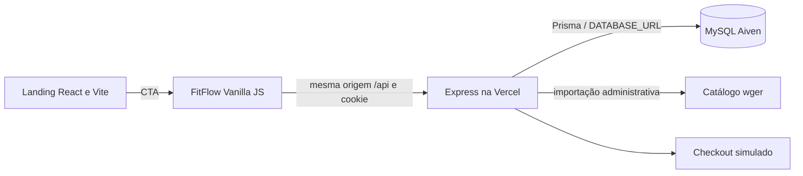

# FitFlow — diagnóstico e plano de entrega

Análise realizada em 07/10/2026. Objetivo: descobrir a falha de login, revisar os dois projetos e selecionar integrações úteis para a entrega acadêmica da próxima semana.

Registro histórico do diagnóstico inicial. Menções a arquivos antigos, falhas e recursos pendentes descrevem aquele momento; alterações posteriores e seus limites estão em [Estado atual da entrega](STATUS_ENTREGA.md). O diagnóstico do banco remoto ainda exige validação após a configuração de uma nova conexão.

## 1. Por que o login falha

**A Vercel está tentando consultar um banco MySQL da Aiven cujo endereço atualmente não resolve no DNS. A consulta falha antes da comparação da senha.**

Evidências coletadas na implantação de produção [FitFlow](https://fit-flow-indol.vercel.app):

| Verificação | Resultado | Interpretação |
|---|---|---|
| GET da página inicial | HTTP 200 | O frontend está publicado |
| GET `/api/health` | HTTP 200, `production` | A função responde; essa rota não consulta o banco |
| Uma tentativa legítima de login com o administrador documentado | HTTP 500, mensagem de erro interno | Falha de infraestrutura durante autenticação |
| Logs de produção da Vercel | `PrismaClientInitializationError` em `prisma.user.findUnique`, `auth.service.js:69` | A API não consegue conectar ao banco |
| Host informado pelo erro | `mysql-261fae4f-fit-flow.a.aivencloud.com:17854` | Destino efetivo da conexão Prisma |
| DNS do host, resolvedor local e `1.1.1.1` | NXDOMAIN | Não há registro DNS disponível para esse endereço |
| Metadados das variáveis Vercel | `DATABASE_URL` e `JWT_SECRET` presentes em production/preview | Não é simplesmente ausência dessas variáveis; os valores secretos não foram extraídos |

Trecho relevante do log, sem credenciais:

```text
PrismaClientInitializationError
Invalid prisma.user.findUnique()
Can't reach database server at mysql-261fae4f-fit-flow.a.aivencloud.com:17854
AuthService.login (.../server/src/services/auth.service.js:69:18)
```

Projeto Vercel: `fit-flow`. Implantação examinada: `dpl_3LKeE8UvB32Aqi1g3HyrBAgYA234`, criada em 28/04/2026. O fluxo usa e-mail e senha próprios do FitFlow; as credenciais mencionadas são contas de demonstração descritas no GitHub.

**Ainda não é possível distinguir se o serviço Aiven foi removido, suspenso ou recriado com outro endereço.** Essa distinção exige consultar o painel da Aiven. A documentação informa que serviços gratuitos podem ser suspensos por inatividade; isso é uma hipótese, pois não confirmei o plano desse serviço. [Aiven: MySQL gratuito](https://aiven.io/docs/products/mysql/concepts/mysql-free-tier).

Outro erro aparece nos logs: `ERR_ERL_UNEXPECTED_X_FORWARDED_FOR`. O Express não configura `trust proxy`, embora a Vercel envie esse cabeçalho. Isso precisa ser corrigido conforme a topologia real do proxy; não basta aceitar indiscriminadamente qualquer IP encaminhado. Esse erro também aparece em requisições que retornam 200 e não é o erro Prisma que causou o login 500. [Documentação do express-rate-limit](https://express-rate-limit.mintlify.app/reference/error-codes#err-erl-unexpected-x-forwarded-for), [Express: proxies](https://expressjs.com/en/guide/behind-proxies.html).

### Recuperação recomendada

1. Consultar o serviço Aiven e verificar estado, endpoint atual e backups disponíveis.
2. Se o serviço antigo puder ser recuperado, preservar o banco existente. Se houver banco novo, restaurar backup quando disponível.
3. Ajustar `DATABASE_URL` no projeto correto da Vercel para o endpoint válido, com conexão TLS compatível com o provedor. Conferir também o ambiente preview.
4. Verificar conectividade e schema em uma cópia de desenvolvimento. Revisar as migrations antes de executá-las: o histórico atual não reconstrói todo o schema.
5. Verificar quais usuários existem. Criar contas demonstrativas deliberadamente; o seed completo atual não é seguro para repetição indiscriminada.
6. Publicar nova implantação após alterar variáveis de ambiente e executar o roteiro de aceitação abaixo.

Não execute `db:reset` contra o banco publicado. A análise não alterou variáveis, usuários, banco ou implantação.

## 2. Um segundo problema nas credenciais

O README documenta `aluno@fitflow.com`, mas `server/prisma/seed.js` cria `joao@email.com`, `maria@email.com` e `pedro@email.com`. Portanto, recuperar o banco não garante que o login de aluno do README funcione. A existência atual dessas contas em produção não foi verificada.

O README manda executar `node seed_direct.js`. Esse script cria somente o catálogo de exercícios e usa MySQL local fixo; **ele não cria usuários** e não passa a usar Aiven por receber `DATABASE_URL`. O seed Prisma é outro fluxo. Além disso:

- `server/database/schema.sql` e `seed.sql` usam tabelas antigas como `usuarios`, enquanto o login atual consulta `users` pelo Prisma.
- O seed Prisma usa `upsert` para contas, mas cria treinos, cargas e pagamentos novamente. Repeti-lo pode duplicar dados; `update: {}` também não atualiza a senha de uma conta já existente.
- A configuração Prisma atual avisa que `prisma.config.ts` substitui o bloco de configuração do `package.json`; revisar a declaração do comando de seed nessa configuração antes de usá-lo.
- As datas dos alunos demonstrativos podem estar vencidas em um banco populado meses atrás. Isso pode bloquear funcionalidades mesmo após o login funcionar.

## 3. Escopo e arquitetura

Foram conferidos os checkouts locais contra o `main` remoto:

- Sistema: `afbfc4284d332f9956b99a42fd42e8e7468f005a`.
- Landing page: `555240a5e08f476381cd8479a8078e2e13720260`.

A revisão inclui as alterações locais existentes de layout. Elas foram preservadas. Foram lidos os oito Markdown próprios encontrados: README dos dois repositórios, RULES, SKILLS_GUIDE, CONTEXT_HANDOVER, PROGRESS, MASTER e dashboard. Arquivos de documentação instalados dentro das dependências e da biblioteca `.agent` não representam documentação do produto.



Na Vercel, a entrada é `server/src/app.js`; `server.js`, usado no `npm start`, não executa ali. O health atual retorna sucesso sem testar Prisma. O módulo `config/database.js` define um pool mysql2 com `DB_*`, mas não foi encontrado consumidor ativo dele nos fluxos de produção: o login e catálogo atuais usam Prisma e `DATABASE_URL`.

Pontos existentes úteis: bcrypt, cookie HttpOnly/Secure em produção, separação entre User e Student, autorização administrativa na maioria das rotas, transação para pagamento/matrícula, vínculo do exercício ao aluno no registro de carga e constraint de presença diária.

## 4. Falhas prioritárias

As evidências detalhadas de segurança foram registradas no relatório interno do Codex Security, execução `afbfc4284d332f9956b99a42fd42e8e7468f005a_20261007T223819Z_n_u39yz9`. O arquivo interno não está disponível no checkout atual; a tabela abaixo preserva o resumo histórico, não uma validação de todas as correções posteriores. A validação desses caminhos foi por leitura de código, sem exploração da produção.

| Prioridade de entrega | Problema | Correção proposta |
|---|---|---|
| Imediata | Banco Aiven inacessível impede login | Recuperar serviço/endpoint, conferir schema e contas, republicar e testar |
| Imediata | `/api/auth/register` público aceita `role: admin` | Proteger criação privilegiada; no cadastro público, fixar `student` no servidor |
| Imediata | Texto `paymentMethod` do aluno é persistido e inserido em `innerHTML` no painel admin | Allowlist no servidor e renderização por `textContent`; CSP adicional |
| Alta | Matrículas recebem a mesma senha inicial conhecida | Convite de uso único ou senha individual temporária com troca obrigatória |
| Alta | Aluno envia `studentId` de terceiro no check-in | Sempre derivar perfil do JWT para aluno; seleção de terceiros exclusiva de admin |
| Alta | Conta desativada mantém JWT até expirar | Consultar `User.active` no middleware ou adotar revogação/versionamento de sessão |
| Alta | Fallback público de `JWT_SECRET` quando variável ausente | Falhar ao iniciar sem segredo válido; não há evidência de fallback ativo na Vercel atual |
| Alta | Migration inicial incompleta | Criar e testar migrations que incluam catálogo e campos novos de Checkin |
| Alta | Relatório de inadimplência seleciona `User.phone`, campo inexistente | Buscar `Student.phone`; confirmação com modelo Prisma gerado |
| Alta | Cliente trata todo 403 como sessão inválida | Logout apenas por autenticação inválida; exibir restrição financeira sem encerrar sessão |
| Alta | Renovação antecipada pode reduzir dias já pagos | Definir regra: mesma assinatura usa base `max(dataPagamento, vencimentoAtual)`; troca de plano tem política explícita |
| Alta | Checkout confirma `paid` ao clicar, sem gateway | Identificar claramente como simulação, isolar dados demonstrativos; gateway em sandbox se exigido pelo professor |
| Média | Cancelar presença e registrar novamente conflita com UNIQUE aluno/dia | Definir restauração auditada do registro ou modelo de eventos compatível com a regra |
| Média | Contagem de presença exclui cancelados, listagem de hoje os inclui | Uniformizar filtro ou separar claramente totais e cancelamentos |
| Média | `instructor` existe no schema/seed, mas gestão de treinos exige `admin` | Definir matriz de permissões e implementar instrutor se fizer parte do escopo |
| Média | `/auth/refresh` retorna sucesso sem implementar renovação; recuperação de senha é link vazio | Implementar ou apresentar essas funcionalidades como indisponíveis |
| Média | Resposta HTML de erro Vercel aparece como internet offline | Interpretar Content-Type e preservar status HTTP antes de tentar JSON |
| Média | Alterar pagamento não reconcilia matrícula e não mantém trilha de mudanças completa | Política de ajustes/estornos e eventos auditados, com transação |
| Média | Escrita de cargas não aplica bloqueio financeiro nem verifica treino ativo | Aplicar regra central de elegibilidade também à escrita |
| Média | Datas dependem do fuso do processo e de conversões por strings | Fixar dia de negócio em São Paulo e guardar instantes UTC; testar virada de dia/mês |
| Média | `client/css/pages.css:472` contém bloco sem fechamento | Revisar alteração local; PostCSS aponta `Unclosed block` |

Outras melhorias: padronizar validação dos corpos e tipos com limites de paginação; impedir seleção de plano inativo no checkout; remover hash de senha da resposta de criação de matrícula; ajustar logout para remover apenas o armazenamento do FitFlow; restaurar sessão pela API mesmo sem metadados locais; fixar versões de Lucide/Chart.js/Sortable; atualizar documentação e CI. O workflow atual tem testes comentados e um passo de deploy que apenas imprime uma mensagem.

As diretrizes visuais também estão divergentes: MASTER cita Fira, CSS usa Barlow, e o override do dashboard descreve seções de landing page. Atualizar os documentos para refletir o produto. Responsividade e contraste precisam de verificação visual em celular; presença de media queries não comprova essa qualidade.

## 5. Landing page

[Landing publicada](https://fitflow-lp.vercel.app) responde HTTP 200 e direciona o CTA principal para o FitFlow correto. O dashboard dentro desse repositório é uma demonstração separada: dados fixos, várias ações sem persistência e rotas não implementadas redirecionando para Overview. A rota pública de demonstração não foi confundida com acesso administrativo ao banco real.

Problemas encontrados:

- `vite.config.ts` substitui `process.env.GEMINI_API_KEY` no código do navegador. Se configurada, a chave será exposta no bundle. Não confirmei a presença de uma chave na implantação. Mover a chamada Gemini para servidor autenticado com limites de uso.
- `generateAIWorkout` faz uma geração, descarta o resultado e chama uma segunda geração JSON: duas chamadas para uma ação.
- O botão de salvar treino demonstrativo não grava no sistema principal; não apresentar como funcionalidade integrada.
- O bundle principal gerado possui cerca de 1,08 MB sem compressão e 297 KB gzip. Separar dashboard/charts/IA por importação dinâmica.
- HTML `lang=en`, título genérico do AI Studio e README genérico devem ser adequados ao projeto.

## 6. Plugins e MCPs disponíveis

MCP/plugin auxilia o desenvolvimento e o diagnóstico. O aplicativo precisa de biblioteca/API e código próprios para autenticar usuários, receber pagamentos ou persistir dados.

| Ferramenta instalada | Estado verificado | Uso no FitFlow |
|---|---|---|
| GitHub | Conexão acessível | Inspeção de repositório, issues, revisão e futuras PRs |
| Vercel | Plugin retorna UNAUTHORIZED; CLI autenticada funciona | Logs e metadados foram consultados pela CLI; reconectar plugin facilita próximos diagnósticos |
| Supabase | Listagem de projetos acessível | Possível banco/Auth futuro; não foi localizado projeto ativo FitFlow na conta consultada |
| Codex Security | Auditoria aplicada | Achados com evidência e relatório próprio |
| Superpowers | Skills disponíveis e debugging aplicado | Investigação estruturada e verificação das conclusões |
| Computer Use | Instalado; runtime falhou ao iniciar | Não houve inspeção visual do desktop ou browser; arquivos e CLI permitiram continuar |
| Plugin Management | Busca acessível | Inventário e pesquisa de capacidades |

As buscas no catálogo por Aiven, Mercado Pago e Playwright não retornaram plugins. O catálogo não é exaustivo; existem integrações externas oficiais descritas abaixo. [Diretório de plugins](https://chatgpt.com/plugins).

## 7. Integrações selecionadas

### Autenticação e banco de academia

**Para a próxima semana:** manter Express + Prisma + MySQL, restaurar Aiven e corrigir autorização/sessões. É o caminho com menos conversões.

**Para evolução:** [Better Auth](https://github.com/better-auth/better-auth) possui integração oficial com [Express](https://better-auth.com/docs/integrations/express). Avaliar o adapter Prisma/MySQL e migração de usuários, tabelas e sessões. É uma mudança planejada, não uma biblioteca que basta instalar para corrigir o login atual.

[Supabase](https://github.com/supabase/supabase) reúne Postgres e Auth. Seu [MCP oficial](https://supabase.com/docs/guides/ai-tools/mcp) pode ser limitado ao projeto e a leitura. O projeto atual usa MySQL: migrar requer converter provider, tipos nativos, migrations, consultas SQL e estratégia de autenticação. Trocar somente a URL não funciona.

O schema existente já cobre User, Student, Plan, Workout, Exercise, WorkoutLog, Payment, Checkin e catálogo. Não é necessário importar o banco inteiro de outro sistema de academia. Priorizar:

- Migrations reproduzíveis e backup restaurável.
- Separar matrícula/assinatura, cobrança de mensalidade e transação recebida do gateway.
- Campo único para identificador de pagamento/evento do provedor e trilha de ajustes.
- Datas e bloqueios calculados de forma consistente, índices orientados às consultas reais.
- `gymId` e isolamento entre academias somente se houver requisito de múltiplas unidades/clientes.

### Catálogo de exercícios

1. **[wger](https://github.com/wger-project/wger): primeira escolha**, pois o sistema já possui importador. A [API oficial](https://github.com/wger-project/docs/blob/master/docs/api/api.rst) oferece dados de exercícios. O [MCP oficial wger](https://github.com/wger-project/mcp-server) ajuda a pesquisar exercícios, músculos e equipamentos durante o desenvolvimento. Rever IDs de idioma, paginação, timeout e atualização sem duplicatas no importador atual. Conferir licenças do código AGPL e licenças específicas de conteúdo/imagens antes de redistribuir.
2. **[free-exercise-db](https://github.com/yuhonas/free-exercise-db): alternativa simples**, com mais de 800 exercícios em JSON, instruções e imagens; o repositório declara Unlicense. Conferir a origem/licença das mídias utilizadas e mapear nomes/idiomas antes de incorporar. Importar versão fixa para tornar a demonstração reproduzível.

### Pix e cartão

**Primeira opção: Mercado Pago em sandbox**, com checkout hospedado para reduzir trabalho com cartão. Usar [SDK Node oficial](https://github.com/mercadopago/sdk-nodejs), [SDK de navegador](https://github.com/mercadopago/sdk-js) quando necessário e [OpenAPI](https://github.com/mercadopago/openapi) como referência.

Há **plugin oficial para Codex** e MCP HTTP do Mercado Pago, embora não tenham aparecido no catálogo conectado. A [documentação oficial de instalação](https://www.mercadopago.com.br/developers/pt/docs/mp-point/create-application) informa:

```text
codex plugin marketplace add mercadopago/mercadopago-codex-marketplace
codex plugin add mercadopago@mercadopago-codex-marketplace
MCP HTTP: https://mcp.mercadopago.com/mcp
```

Fluxo mínimo do aplicativo: criar cobrança no servidor → abrir checkout → receber webhook → validar assinatura e consultar pagamento no provedor → conferir referência, valor, moeda e status aprovado → gravar transação de forma idempotente → atualizar matrícula. O botão do navegador não comprova pagamento. Não usar dados reais de cartão na simulação atual. [Mercado Pago: Webhooks](https://www.mercadopago.com.br/developers/pt/docs/your-integrations/notifications/webhooks).

**Alternativa: Stripe**, com [MCP oficial](https://docs.stripe.com/mcp). Conferir elegibilidade da conta e meios de pagamento antes de selecionar. A documentação atual informa que contas Stripe brasileiras suportam Pix avulso em BRL, e Pix Automático não está disponível para essas contas; não assumir recorrência Pix no Brasil por existir suporte em outros mercados. [Stripe: Pix](https://docs.stripe.com/payments/pix).

### Mobile e persistência

São três requisitos diferentes:

| Necessidade | Implementação |
|---|---|
| Abrir no celular e ver os mesmos registros do desktop | API + banco central; testar navegador mobile e sessão |
| Instalar como aplicativo e abrir estrutura sem internet | PWA: manifest, ícones, service worker e cache de arquivos |
| Consultar treino e registrar cargas sem conexão | IndexedDB + fila de sincronização + idempotência no servidor |

O projeto tem CSS responsivo e cookie/localStorage de identificação, mas não tem manifest, service worker ou armazenamento offline estruturado.

**Recomendação:** começar com PWA. [Dexie](https://github.com/dexie/Dexie.js) simplifica IndexedDB; a [documentação](https://dexie.org/docs/) e a [referência de armazenamento do navegador](https://developer.mozilla.org/en-US/docs/Learn_web_development/Extensions/Client-side_APIs/Client-side_storage) ajudam na implementação. Cache deve ser por usuário, com versão e limpeza ao trocar conta. A fila de cargas precisa de UUID único, estado pendente e tratamento de conflito/expiração de sessão. Não apresentar pagamento offline como quitado nem cache de mensalidade como autoridade de acesso. Armazenamento do navegador pode ser removido; backup/sincronização no servidor continuam necessários.

Depois, [Capacitor](https://github.com/ionic-team/capacitor) pode empacotar a interface existente para Android/iOS. Testar origem, cookies, retomada do app e rede conforme a [documentação oficial](https://capacitorjs.com/docs). Reescrever tudo em React Native antes da apresentação aumentaria o escopo sem resolver o banco atual.

Para testar, o [Playwright MCP oficial](https://github.com/microsoft/playwright-mcp) é útil para navegação e inspeção automatizada. Uma suíte de testes Playwright do projeto continua necessária para regressões repetíveis; o MCP não a substitui.

## 8. Verificações realizadas e limites

| Verificação | Resultado |
|---|---|
| Sintaxe de 65 JS de client/backend/scripts/Prisma | Sem erros em `node --check` |
| Prisma validate com URL MySQL fictícia, sem conexão | Schema válido |
| Prisma validate com ambiente original do terminal | P1012: variável `DATABASE_URL` herdada aponta PostgreSQL, apesar do `.env` local usar MySQL |
| Landing `npm ci --ignore-scripts`, `npm run lint` e build | Concluídos; lint é `tsc --noEmit`, não ESLint |
| Parsing dos sete CSS do sistema com PostCSS | Seis válidos; `pages.css` possui bloco aberto na linha 472 |
| Cinco diagnósticos com dependências simuladas | Confirmados, sem banco/requisições externas |
| `npm audit --omit=dev` backend | 8 avisos: 1 critical, 4 high, 2 moderate, 1 low |
| `npm audit --omit=dev` landing | 15 avisos: 1 critical, 9 high, 3 moderate, 2 low |

Os cinco diagnósticos isolados confirmam: logout no 403; status 502/HTML convertido em erro de internet; renovação antecipada reduzindo vencimento; check-in de terceiro aceito pelo controller; e seleção de `User.phone` incompatível com o modelo gerado. Script: `tmp/diagnostic-behavior.cjs`; executar `node tmp/diagnostic-behavior.cjs` na raiz.

Os avisos do npm são evidência de dependências sinalizadas, não prova de exploração de cada uma. A landing é publicada estaticamente e inclui dependências de servidor/build; avaliar quais chegam ao runtime, remover as não usadas e aplicar atualizações compatíveis. Não fazer `audit fix --force` sem revisar alterações de versão e repetir build/regressão.

A variável PostgreSQL herdada é um problema do ambiente local encontrado nesta sessão; não foi confundida com a causa Aiven da Vercel. `dotenv` não sobrescreve variáveis existentes por padrão. Nenhuma configuração persistente do computador foi alterada.

Não houve teste completo de CRUD no banco, navegador mobile, restauração de backup, gateway ou API autenticada após login: o banco publicado não está acessível e o runtime de Computer Use falhou. Nenhuma alteração de código funcional foi aplicada nesta análise. Build aprovado não equivale a sistema pronto para entrega.

## 9. Plano para a próxima semana

| Etapa | Entrega verificável |
|---|---|
| Dia 1 | Banco recuperado, migrations revisadas, contas demonstrativas coerentes, login/me/logout funcionando |
| Dia 2 | Cadastro privilegiado protegido, XSS removido, propriedade do check-in e desativação corrigidas, credenciais individuais |
| Dia 3 | Relatórios, renovação, datas, cancelamento de presença e tratamento HTTP corrigidos; papel instrutor definido |
| Dia 4 | Fluxos admin/aluno no celular, persistência ao atualizar/fechar/abrir, landing identificada como demonstração; PWA básica se exigida |
| Dia 5 | Testes de aceitação, instalação limpa, documentação, backup restaurado em cópia, versão marcada e ensaio da apresentação |

Pagamento real/sandbox completo, migração Supabase e aplicativo nativo entram somente se forem exigidos no escopo da disciplina e houver tempo após corrigir os bloqueadores.

### Roteiro de aceitação antes da apresentação

- Instalação limpa de uma cópia usando somente README, migrations e seed deliberado.
- Admin e aluno correto entram; credencial inválida retorna 401 e erro de infraestrutura é distinguível.
- `/auth/me` recupera sessão; conta desativada perde acesso; cookie ausente/expirado não permite API.
- Visitante não cria admin; aluno não lê/grava dados de outro aluno; métodos inesperados são rejeitados e textos permanecem textos.
- Admin cadastra aluno, plano e treino; aluno vê seu treino e registra carga; dados permanecem após recarregar e em outro dispositivo.
- Presença duplicada e cancelamento seguem a regra definida; listas e totais são consistentes.
- Renovação antecipada preserva dias contratados; aluno bloqueado recebe mensagem sem logout indevido.
- Relatórios de inadimplência, financeiro e frequência abrem sem erro.
- Checkout demonstrativo está identificado; se integrado, webhook repetido não duplica pagamento, e falha/reembolso não libera acesso indevidamente.
- Celular em 375 px, tablet e desktop: menus, formulários, modais, teclado e tabelas utilizáveis. Testar navegador Android e iOS conforme a disponibilidade.
- Backup restaurado em banco de teste; instruções de execução e limitações entregues ao professor.

## 10. Resultado desta análise

O motivo imediato do login foi identificado com logs e DNS. A recuperação concreta depende do estado do serviço no painel Aiven. Os demais problemas de código, documentação, dados iniciais e integrações estão priorizados acima. A meta desta sessão é diagnóstico e relatório; recuperar produção e implementar as correções são trabalho posterior que ainda não foi executado.

A auditoria Codex Security foi finalizada com seis achados: três high e três medium. Cobertura de origem: 90 arquivos do inventário revisados, com exclusões explícitas para dependências, metadados, imagem binária e artefatos gerados. Candidatos equivalentes dos revisores foram consolidados; o bloqueio financeiro de cargas foi tratado no diagnóstico funcional. O plugin registrou mudança no working tree durante a análise: foi criado este relatório; os arquivos funcionais já modificados pelo usuário foram preservados.

Contadores retornados pelo plugin para os quatro threads da revisão: 14.723.174 tokens totais, incluindo 13.930.880 tokens de entrada em cache, 14.638.612 de entrada e 84.562 de saída. Esses contadores acumulados do rollout não são uma estimativa de cobrança nem uma comparação de preço entre modelos.
